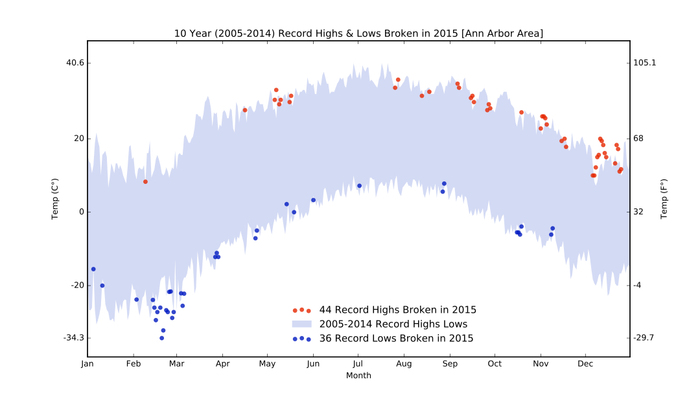
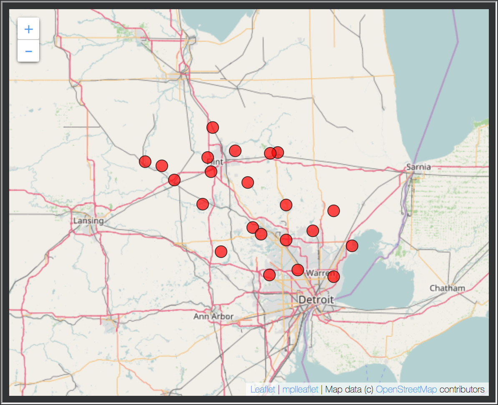

# WeatherPipeline for Applied Plotting, Charting & Data Representation in Python

In Assignment 2 of Applied Plotting, Charting & Data Representation in Python,
learners are asked to create a visualization based on their local weather
data.

 

 

The weather data was from the
[Global Historical Climatology Network - Daily (GHCN-Daily)](https://data.noaa.gov/dataset/global-historical-climatology-network-daily-ghcn-daily-version-3).

This is the code used to downloaded, clean, format, and test the data.

## File Descriptions

`Weather Data Pipeline.ipynb` - Combines all of the notebooks into one data pipeline.

`GHCN-D Downloader.ipynb` - Downloads the GHCN-D data and cleans it up.

`Binning.ipynb` - Splits the surface of the earth into equal area bins.
Creates folders by bin size and in each folder are csvs of the binned data.

`CSV_checker.ipynb` - Checks each csv file to make sure it fulfills the conditions
needed for the assignment.

`Plot_Bin.ipynb` - Used to plot the weather stations in the specified bin on a map.

`ghcn_daily_readme.txt` & `ghcn_daily_by_year_readme.txt` - readme's for the GHCN data.

